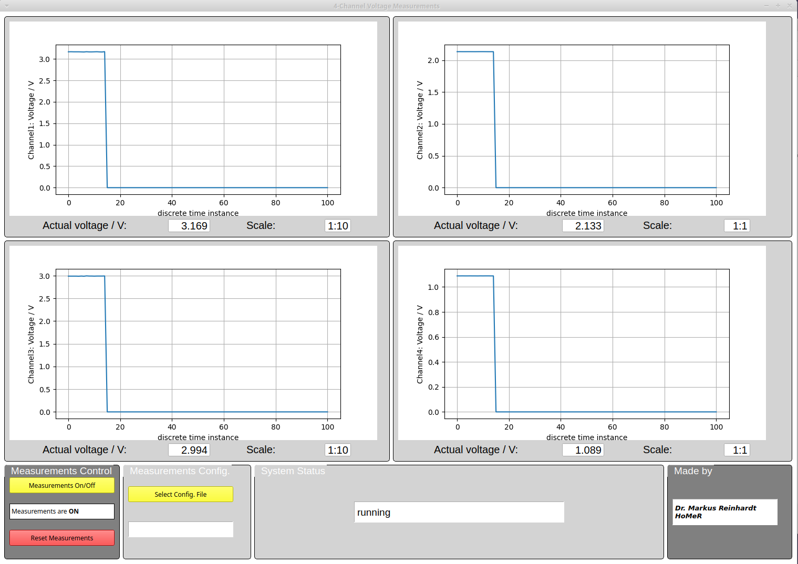

# MySimple4ChannelDAS

A simple 4 channel data acquisition system realized with a 4 channel ADC module and an Arduino Uno.
The Uno communicates with the PC via the serial port and CmdMessenger to the PC that is running the data evaluation program.

